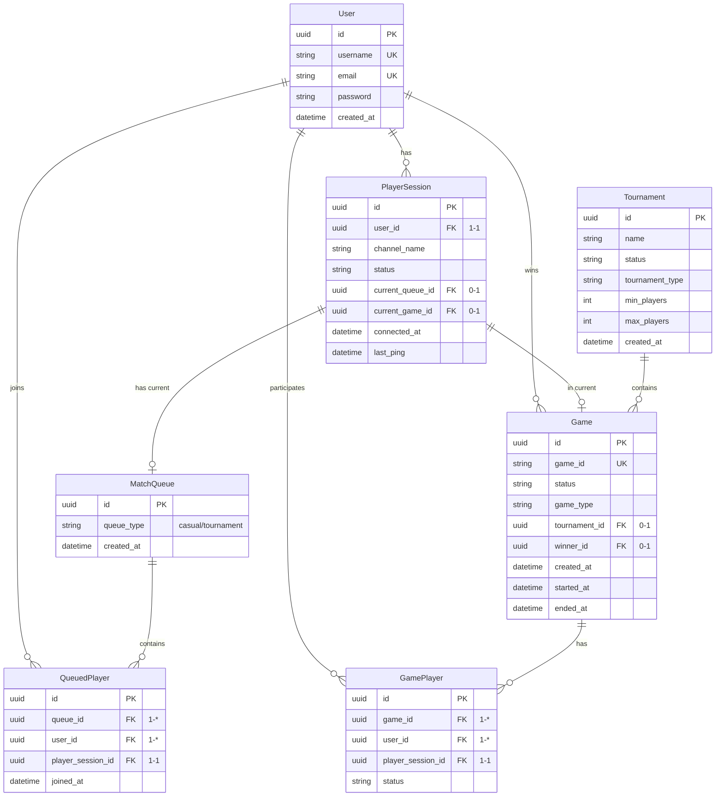

```mermaid
erDiagram
    %% One-to-Many Relationships
    User ||--o{ PlayerSession : "has"
    User ||--o{ QueuedPlayer : "joins"
    User ||--o{ GamePlayer : "participates"
    User ||--o{ Game : "wins"

    %% One-to-One Relationships
    PlayerSession ||--o| MatchQueue : "has current"
    PlayerSession ||--o| Game : "in current"

    %% One-to-Many Relationships
    MatchQueue ||--o{ QueuedPlayer : "contains"
    Game ||--o{ GamePlayer : "has"
    Tournament ||--o{ Game : "contains"

    User {
        uuid id PK
        string username UK
        string email UK
        string password
        datetime created_at
    }

    PlayerSession {
        uuid id PK
        uuid user_id FK "1-1"
        string channel_name
        string status
        uuid current_queue_id FK "0-1"
        uuid current_game_id FK "0-1"
        datetime connected_at
        datetime last_ping
    }

    MatchQueue {
        uuid id PK
        string queue_type "casual/tournament"
        datetime created_at
    }

    QueuedPlayer {
        uuid id PK
        uuid queue_id FK "1-*"
        uuid user_id FK "1-*"
        uuid player_session_id FK "1-1"
        datetime joined_at
    }

    Game {
        uuid id PK
        string game_id UK
        string status
        string game_type
        uuid tournament_id FK "0-1"
        uuid winner_id FK "0-1"
        datetime created_at
        datetime started_at
        datetime ended_at
    }

    GamePlayer {
        uuid id PK
        uuid game_id FK "1-*"
        uuid user_id FK "1-*"
        uuid player_session_id FK "1-1"
        string status
    }

    Tournament {
        uuid id PK
        string name
        string status
        string tournament_type
        int min_players
        int max_players
        datetime created_at
    }
```
