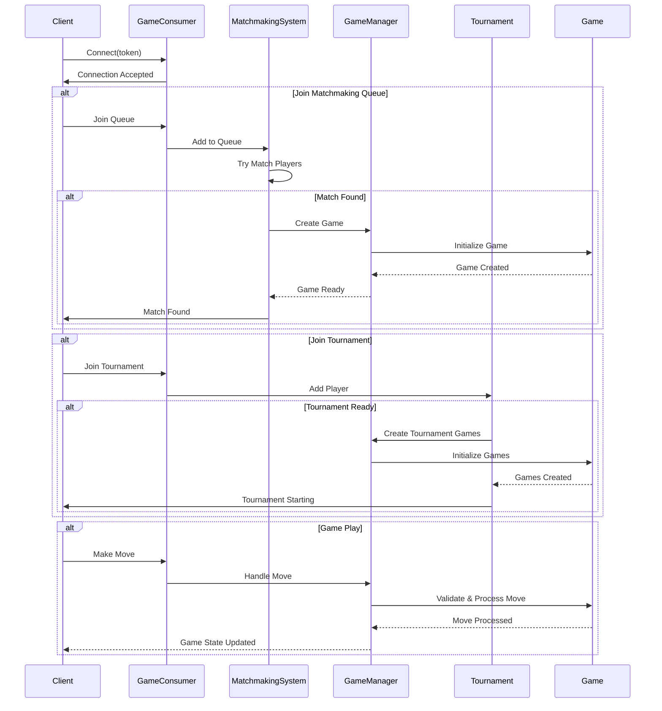
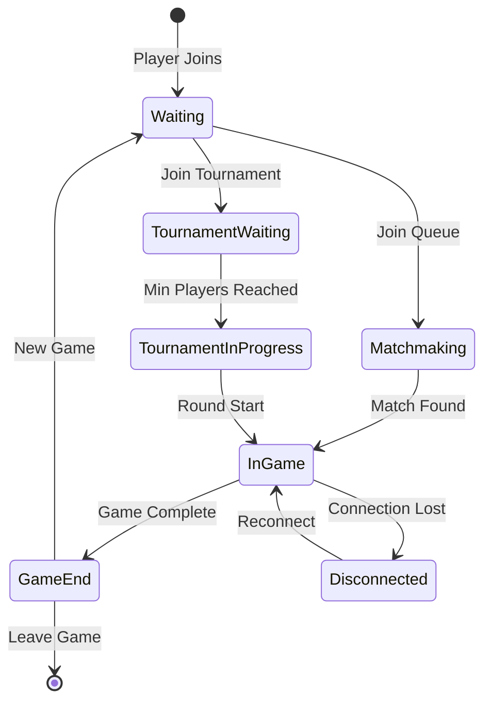

```mermaid
sequenceDiagram
    participant Client
    participant GameConsumer
    participant MatchmakingSystem
    participant GameManager
    participant Tournament
    participant Game

    Client->>GameConsumer: Connect(token)
    GameConsumer->>Client: Connection Accepted

    alt Join Matchmaking Queue
        Client->>GameConsumer: Join Queue
        GameConsumer->>MatchmakingSystem: Add to Queue
        MatchmakingSystem->>MatchmakingSystem: Try Match Players
        
        alt Match Found
            MatchmakingSystem->>GameManager: Create Game
            GameManager->>Game: Initialize Game
            Game-->>GameManager: Game Created
            GameManager-->>MatchmakingSystem: Game Ready
            MatchmakingSystem->>Client: Match Found
        end
    end

    alt Join Tournament
        Client->>GameConsumer: Join Tournament
        GameConsumer->>Tournament: Add Player
        
        alt Tournament Ready
            Tournament->>GameManager: Create Tournament Games
            GameManager->>Game: Initialize Games
            Game-->>Tournament: Games Created
            Tournament->>Client: Tournament Starting
        end
    end

    alt Game Play
        Client->>GameConsumer: Make Move
        GameConsumer->>GameManager: Handle Move
        GameManager->>Game: Validate & Process Move
        Game-->>GameManager: Move Processed
        GameManager-->>Client: Game State Updated
    end
```

STATE DIAGRAM

```mermaid
stateDiagram-v2
    [*] --> Waiting: Player Joins
    
    Waiting --> Matchmaking: Join Queue
    Matchmaking --> InGame: Match Found
    
    Waiting --> TournamentWaiting: Join Tournament
    TournamentWaiting --> TournamentInProgress: Min Players Reached
    TournamentInProgress --> InGame: Round Start
    
    InGame --> GameEnd: Game Complete
    GameEnd --> Waiting: New Game
    
    InGame --> Disconnected: Connection Lost
    Disconnected --> InGame: Reconnect
    
    GameEnd --> [*]: Leave Game

```
